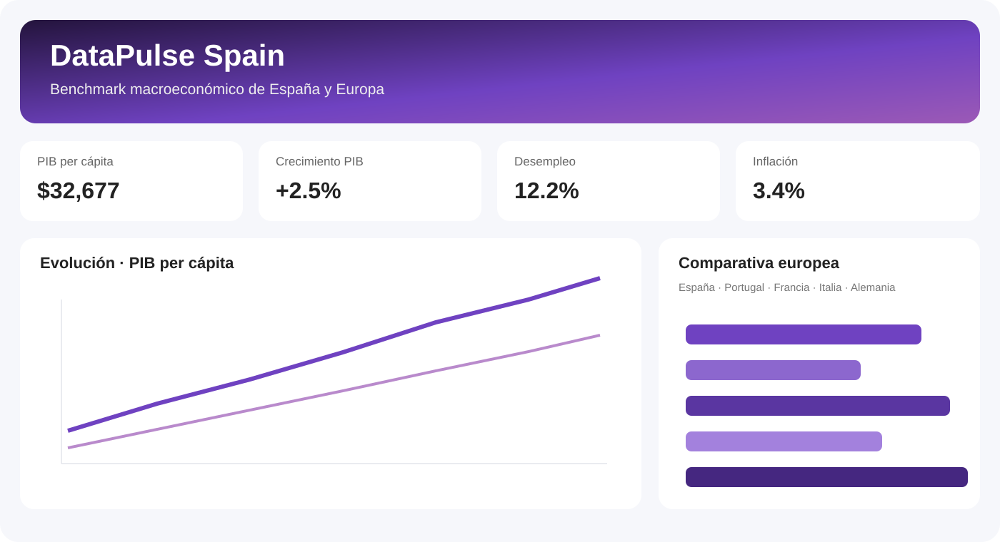

# 📊 DataPulse Spain

[](#)
[](#)
[](#)
[](#)
[](#)

Proyecto end-to-end de **Data Analytics, calidad de datos y automatización** para analizar la evolución macroeconómica de España frente a economías europeas comparables.



> La preview representa la interfaz del dashboard. Los valores mostrados en ella son ilustrativos; al ejecutar el pipeline, la aplicación utiliza los datos descargados de la World Bank Indicators API.

## 🎯 Objetivo

Construir un flujo reproducible que vaya más allá de una visualización aislada:

**API pública → extracción → transformación → controles de calidad → SQLite → KPIs → dashboard**

El proyecto está diseñado como una pieza de portfolio que demuestra organización de código, modelado analítico, SQL, automatización y comunicación de resultados.

## ✨ Qué incluye

- extracción automatizada desde la **World Bank Indicators API**
- normalización y transformación con **Pandas**
- capa explícita de **data quality**
- persistencia analítica en **SQLite**
- variaciones interanuales y snapshots de KPIs
- consultas SQL con funciones de ventana
- dashboard ejecutivo con **Streamlit**
- benchmarking entre España, Portugal, Francia, Italia y Alemania
- tests automatizados con **Pytest**
- CI mediante **GitHub Actions**

## 📈 Indicadores

| Área | Indicador | Código |
|---|---|---|
| Renta | PIB per cápita | `NY.GDP.PCAP.CD` |
| Crecimiento | Crecimiento del PIB | `NY.GDP.MKTP.KD.ZG` |
| Mercado laboral | Desempleo | `SL.UEM.TOTL.ZS` |
| Mercado laboral | Desempleo juvenil | `SL.UEM.1524.ZS` |
| Mercado laboral | Participación laboral | `SL.TLF.CACT.ZS` |
| Precios | Inflación | `FP.CPI.TOTL.ZG` |
| Sector exterior | Exportaciones sobre PIB | `NE.EXP.GNFS.ZS` |
| Demografía | Población | `SP.POP.TOTL` |

## 🧭 Dashboard

La segunda iteración incorpora cuatro vistas:

- **Resumen ejecutivo** con los principales KPIs del país seleccionado.
- **Evolución temporal** para comparar países en una misma serie.
- **Comparativa europea** para un año concreto.
- **Calidad de datos** con warnings y errores detectados en la carga.

## 🏗️ Arquitectura

```text
World Bank API
      │
      ▼
   Extract
      │
      ▼
 Transform ──► Data Quality
      │             │
      └──────┬──────┘
             ▼
          SQLite
             │
       ┌─────┴─────┐
       ▼           ▼
      SQL       Streamlit
```

## 📁 Estructura

```text
src/datapulse/
├── extract/      # consumo de APIs
├── transform/    # normalización
├── quality/      # reglas de calidad
├── load/         # persistencia SQLite
├── analytics/    # KPIs y lógica analítica
└── pipeline.py   # orquestación

dashboard/        # aplicación Streamlit
sql/              # consultas analíticas
tests/            # tests unitarios
data/sample/      # muestra reproducible
docs/             # arquitectura, calidad y preview
.github/workflows # CI
```

## ▶️ Ejecutar

```bash
python -m venv .venv
source .venv/bin/activate  # Windows: .venv\Scripts\activate
pip install -e .[dev]

python -m datapulse.pipeline
streamlit run dashboard/app.py
```

Para trabajar sin conexión:

```bash
python scripts/seed_sample.py
streamlit run dashboard/app.py
```

## ✅ Tests

```bash
pytest -q
```

## 🔎 Calidad de datos

La capa de calidad controla:

- claves duplicadas por país/indicador/año
- valores ausentes
- años inválidos
- valores negativos donde no son válidos
- tasas de desempleo fuera del rango 0–100

Los valores ausentes de la fuente se registran como `warning`; los problemas que rompen la granularidad o la semántica detienen el pipeline.

## 🗺️ Roadmap

- desplegar el dashboard públicamente
- añadir histórico de ejecuciones del pipeline
- generar un score de calidad por carga
- incorporar una segunda fuente pública para reconciliación
- añadir análisis de correlaciones y benchmarking automatizado

## 📚 Fuente

Datos obtenidos mediante **World Bank Indicators API v2**, una API pública que permite consultar series temporales de indicadores en JSON sin API key.